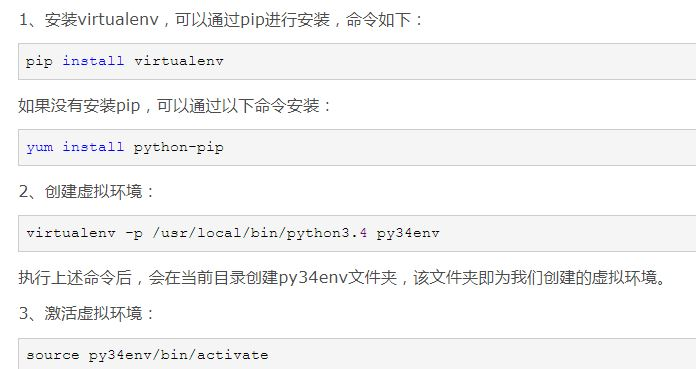
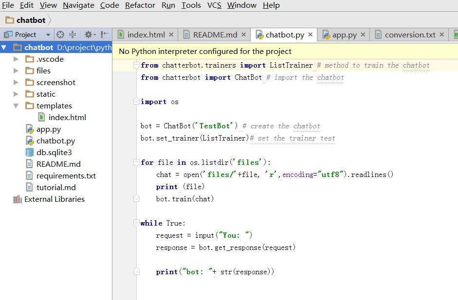
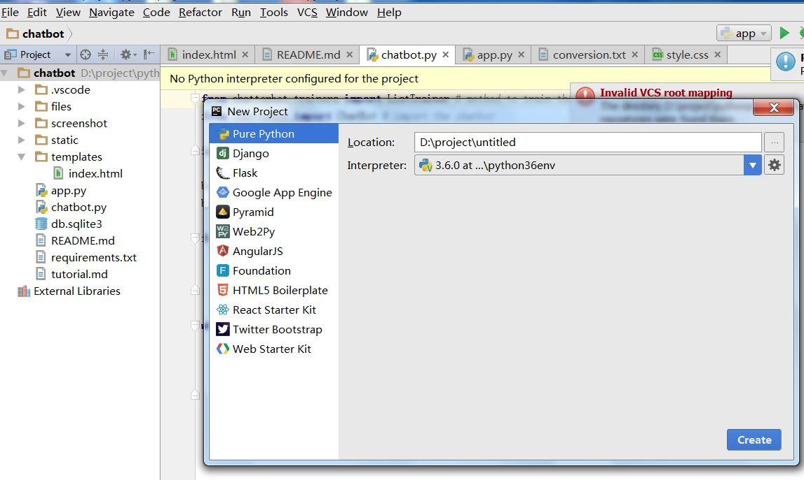

# Implement chatbot with python 

## Agenda

- Introduce chatbot
- introduce python
- install Development environment 
- run our own chatbot
- design our own chatbot
- code  our own chatbot

## Introduce chatbot

quoted from wiki
> A chatbot (also known as a talkbot, chatterbot, Bot, IM bot, interactive agent, or Artificial Conversational Entity) is a computer program or an artificial intelligence which conducts a conversation via auditory or textual methods. Such programs are often designed to convincingly simulate how a human would behave as a conversational partner, thereby passing the Turing test. Chatbots are typically used in dialog systems for various practical purposes including customer service or information acquisition. Some chatterbots use sophisticated natural language processing systems, but many simpler systems scan for keywords within the input, then pull a reply with the most matching keywords, or the most similar wording pattern, from a database.

### Different types of chatbot 

- based on predefined template

- based on indexing 

- based on machine translation 

- based on deep learning 

### Install Development Enviornment 

- python3

- anaconda / virtualenv 

  

- pycharm

  

  

  	

### Demo  

<a href='./video/demo.mp4l'>link</a>

See my [About](./video/demo.mp4) page for details.

### Reference Link
- Virtualenv https://www.the5fire.com/virtualenv-python-env.html
- Anaconda https://blog.csdn.net/jbhand/article/details/77883457 
- Pycharm https://blog.csdn.net/gaokao2011/article/details/77163820 